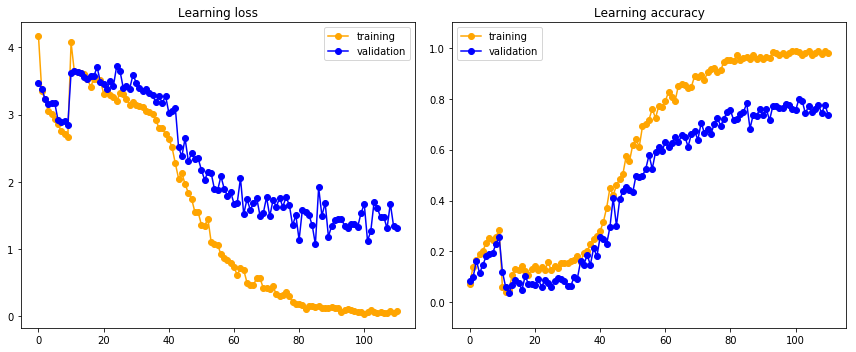
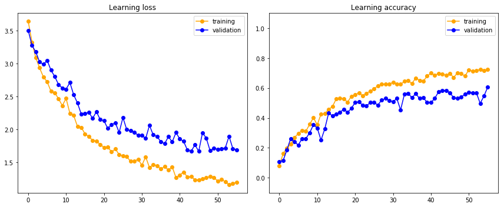
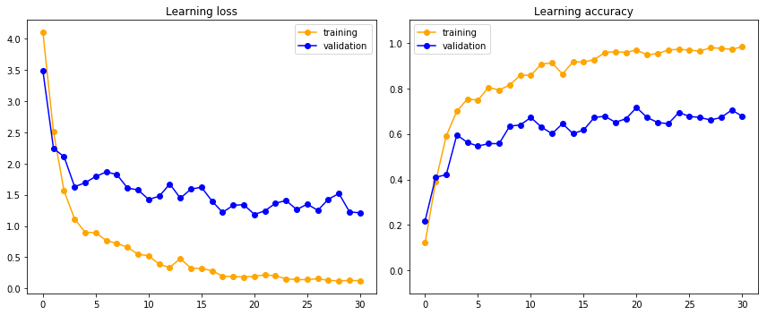

# Brand Recognition Model in Keras

``Goal:`` to build a brand recognition model for [telegram bot](https://t.me/SberBrandBot)

``Result:`` Model was built using Keras on a manually collected images (since we used a custom list of brands). Test accuracy was about 75%. Training took less than an hour because of a small number of training samples.

### Data

Training dataset contained 37 brands with 10-15 hand-picked images from the web and 1 distractor class. 
All images were split into training and validation/test sets. 
The training set numbered 600 samples.
The rest of 215 images were randomly selected to validation and test with a significant overlap to increase the size of a set.
There are real photos and logo drawings.

##### Image samples

### Training

##### Network architecture

Best results were obtained by using pretrained VGG-16 and 2 fully-connected classification layers
Mobilenet, ResNet50, Inception were also used.

A custom convnet with 5 convolution layers (and blocks with 2 convolutions and 1 pooling) and 2 fully-connected classification layers was also tried. 

##### Training options
1. Warming up fully-connected layers before training the full network.
Warmup can be done only for a few epochs or at full lenght
2. Fine-tuning of the full network or just a part of the pretrained model
3. Fine-tuning of the full network without warmup

Several combinations were tested.

##### Optimization configs

Adam was selected as an optimizer. 
Base learning rate was at 1e-3 with plateau reduction by half. It perfromed better than cyclical learning rate and learning rate schedule.

Categorical cross-entropy was used a loss function.

Images were resized to 244. Image augmentation at training and validation included rescaling, zooming, rotation, stretching and squeezing.

Dropout between two fully-connected layers was set to 0.4

### Conclusions

##### Custom convnet
- hard to achieve 50% accuracy on validation
- model produces high overfit
- simpler models such as conv layers instead of conv blocks and smaller input sizes performing better
- accuracy level is not enough for a production bot

##### Custom output layers with pretrained convnet

|Warmup epochs|Pretrained unfreeze|Validation accuracy|
|---|---|---|
|4|last 4 layers| > 70% |
|full|no|~ 70% |
|10|all layers|~ 60%|
|no|all layers| no convergence|
|full|last 4 layers| no convergence |

##### Some interesting charts from training

Short warmup and unfreeze last convolutional block for training

Short warmup and unfreeze all of the pretrained net for training

Train only fully-connected layers
